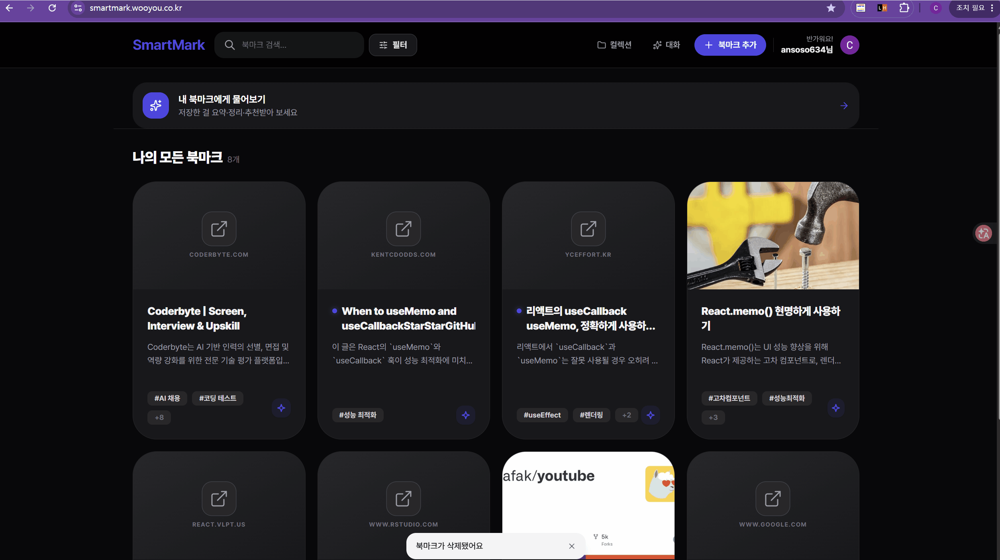
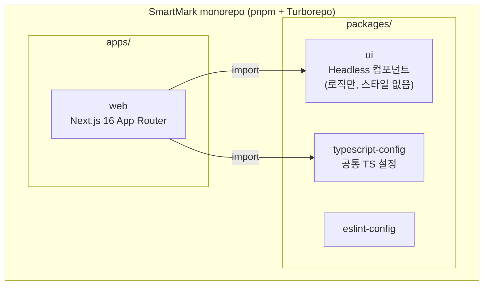
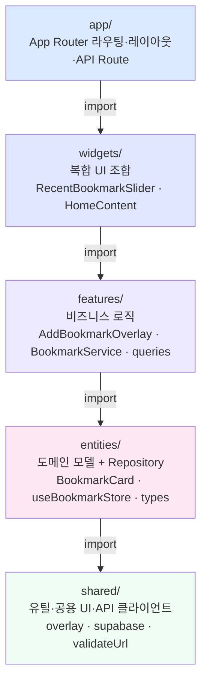
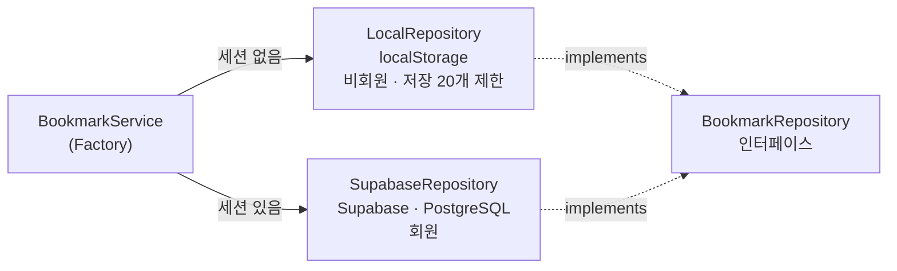
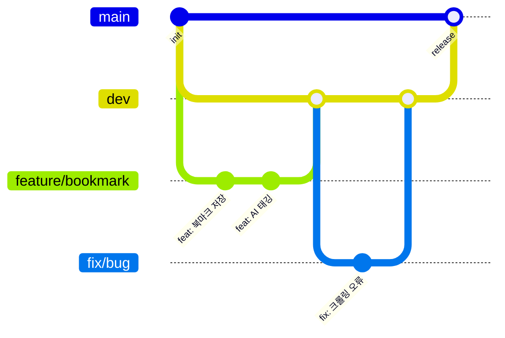

# SmartMark

> 저장만 하는 북마크에서, 언제든 꺼내 쓰는 지식 저장소로.

URL을 저장하면 AI가 자동으로 요약·태깅하고, 의미 기반(시맨틱) 검색으로 키워드가 달라도 원하는 콘텐츠를 바로 찾을 수 있는 북마크 앱.

**[배포 링크](https://smartmark.wooyou.co.kr)** · **[기술 결정 문서](./docs/decisions/)**

---

## 데모

**URL 저장 → 카드 즉시 표시 → AI가 제목·요약·태그 자동 완성**



**북마크 RAG 대화 — SSE 스트리밍 답변 + 근거 인용**


---

## 주요 기능

| 기능                        | 설명                                                                              |
| --------------------------- | --------------------------------------------------------------------------------- |
| AI 자동 요약·태깅           | URL 저장 시 Gemini가 3줄 요약 + 태그 자동 생성                                    |
| 북마크 대화 (RAG)           | 저장한 북마크를 근거로 요약·정리·추천, SSE 스트리밍 답변 + 근거 인용              |
| 시맨틱 검색                 | 임베딩 벡터 유사도 기반 의미 검색 (키워드 불일치여도 검색됨)                      |
| 즉각적인 UI 피드백          | AI 완료를 기다리지 않고 카드 즉시 표시, 상태별 UI 전환                            |
| SSR + TanStack Query        | 서버 prefetch → 하이드레이션으로 초기 로딩 네트워크 왕복 1회로 단축               |
| 헤더 깜빡임 없는 네비게이션 | Zustand 전역 인증 상태로 페이지 전환 시 CLS 0 달성                                |
| 비회원 체험                 | localStorage 기반 20개 저장 + 대화 하루 5회 체험, 로그인 시 무제한                |
| 태그 필터링                 | 복수 태그 선택 + URL 쿼리스트링 기반 상태 관리                                    |
| 북마크 편집                 | 우측 슬라이드 패널에서 제목·태그 인라인 편집                                      |
| 크롬 익스텐션               | 원클릭 저장 · 브라우저 북마크 import · AI 자동 분류 ([아래 섹션](#크롬-익스텐션)) |

---

## 크롬 익스텐션

수집과 관리를 분리했다. **익스텐션은 브라우징 중 "수집" 도구, 웹앱은 앉아서 정리하는 "관리" 도구**로 역할을 나누고, 익스텐션에서 저장한 것은 웹앱으로 단방향 전송된다(양방향 동기화 없음).

| 기능                   | 설명                                                                          |
| ---------------------- | ----------------------------------------------------------------------------- |
| 원클릭 저장            | 현재 보고 있는 탭을 팝업에서 즉시 SmartMark에 저장                            |
| 로그인 연동            | 웹앱과 동일 계정 — 웹에서 로그인 후 토큰을 익스텐션으로 전달                  |
| 브라우저 북마크 import | 크롬 북마크를 폴더 트리로 미리보기 → 전체/개별 선택 후 웹앱으로 가져오기      |
| 북마크 직접 편집       | 제목 인라인 편집 · 폴더 이동(드래그 앤 드롭) · 삭제 · 중복 URL 감지(⚠️ 뱃지)  |
| AI 자동 분류           | 전체 북마크를 AI가 카테고리로 분류 → 미리보기에서 편집 → 브라우저 폴더로 저장 |

**기술 포인트**

- **Manifest V3** 기반, [WXT](https://wxt.dev) 프레임워크로 구성. `bookmarks`·`tabs`·`sidePanel`·`storage` 권한 사용.
- **`chrome.bookmarks` API 직접 호출** — 정리 탭의 모든 편집(수정·이동·삭제)이 브라우저 북마크에 즉시 반영된다.
- **폴더 트리 + 체크박스 UI는 사이드패널**에 배치 — 팝업은 트리를 펼치기엔 좁기 때문.
- **대량 import 대비** — URL 중복은 서버에서 1회 쿼리로 스킵, AI 파이프라인은 순차 처리(rate limit 버퍼)로 Gemini 호출 폭주를 완화.

**웹앱과의 인증 연동** — 익스텐션은 브라우저 쿠키에 접근할 수 없어, 웹 로그인 후 `/auth/extension-token`으로 리다이렉트해 발급된 토큰을 익스텐션이 감지·저장(`chrome.storage.local`)하는 방식으로 세션을 공유한다. 저장/가져오기/AI 정리 요청은 `Authorization: Bearer <token>`으로 웹앱 API(`/api/extension/*`)를 호출한다.

---

## 기술 스택

| 분류            | 기술                             |
| --------------- | -------------------------------- |
| 프레임워크      | Next.js 16 (App Router)          |
| 언어            | TypeScript strict                |
| 스타일          | Tailwind CSS v4                  |
| 서버 상태       | TanStack Query v5                |
| 클라이언트 상태 | Zustand v5 (UI 상태 전용)        |
| DB / Auth       | Supabase (PostgreSQL + pgvector) |
| AI 요약·태깅    | Gemini 2.5-flash                 |
| AI 임베딩       | gemini-embedding-001 (3072차원)  |
| 크롤링          | Cheerio                          |
| 폼 유효성       | React Hook Form + Zod            |
| 테스트          | Vitest + Playwright              |
| 모노레포        | pnpm + Turborepo                 |
| 배포            | Vercel                           |

---

## 아키텍처

### 모노레포 구조 (Turborepo)



### 레이어 구조



역방향 import 금지. 레이어 경계 덕분에 백엔드 분리 또는 React Native 앱 추가 시 영향 범위가 Repository 구현체 중심으로 좁혀진다.

### Repository 패턴



`BookmarkService` (Factory)가 세션 유무로 구현체를 동적 선택. 스토리지가 바뀌어도 상위 레이어 코드는 변경 없음.

### 렌더링 전략

페이지별로 최적 렌더링 전략을 의식적으로 선택했다.

| 페이지       | 전략 | 이유                                                      |
| ------------ | ---- | --------------------------------------------------------- |
| `/landing`   | SSG  | 정적 콘텐츠, `"use client"` 제거로 SEO + 빌드타임 렌더링  |
| `/`          | SSR  | 회원 북마크 prefetch → 하이드레이션, 초기 fetch 왕복 제거 |
| `/bookmarks` | SSR  | 동일, 검색 페이지도 초기 목록 서버에서 미리 로드          |
| `/login`     | CSR  | 인증 폼, 서버 데이터 불필요                               |

### 서버 상태 관리 — TanStack Query v5

서버 상태(북마크 목록)와 클라이언트 UI 상태(선택된 북마크 ID)를 분리해 관리한다.

```
TanStack Query  →  서버 상태: 북마크 목록 캐싱, 낙관적 업데이트
Zustand         →  UI 상태: selectedBookmarkId (패널 열림/닫힘)
                         auth (전역 인증 상태, 헤더 깜빡임 방지)
```

업데이트 시 낙관적 업데이트 → 실패 시 자동 롤백:

```ts
onMutate: async ({ id, data }) => {
  await queryClient.cancelQueries({ queryKey: bookmarkKeys.all });
  const previousData = queryClient.getQueriesData<Bookmark[]>({ ... });
  queryClient.setQueriesData(..., old => old.map(b => b.id === id ? { ...b, ...data } : b));
  return { previousData };
},
onError: (_err, _vars, context) => {
  context?.previousData.forEach(([key, value]) => queryClient.setQueryData(key, value));
},
```

### 북마크 저장 파이프라인

```
URL 입력
  → DB 저장 (aiStatus: "crawling")  →  카드 즉시 표시
  → /api/crawl        Cheerio로 OG 메타 + 본문 추출
  → /api/ai-analyze   Gemini 2.5-flash로 3줄 요약 + 태그 생성  (aiStatus: "processing")
  → /api/embed        gemini-embedding-001로 3072차원 벡터 생성
  → DB 업데이트       (aiStatus: "completed")
```

AI 작업은 UI 차단 없이 백그라운드에서 순차 실행. 각 단계 완료 시 카드 UI가 실시간 업데이트됨.

Gemini 응답은 Zod 스키마로 검증한다. 핵심 산출물인 요약(`summary`)이 누락되거나 비어 있으면 저장하지 않고 실패 처리하며, 태그(`tags`)처럼 보조 데이터는 빈 배열로 복구해 LLM 출력 오류가 사용자 데이터로 섞이지 않게 했다.

크롤링 실패와 AI 분석 실패는 `crawl_failed` / `failed`로 분리해 카드에서 다른 메시지로 안내한다. 실패 카드는 동일한 파이프라인 훅을 재사용해 개별 북마크 단위 재시도를 지원하며, 무한 재시도를 막기 위해 북마크별 최대 3회로 제한했다.

---

## 기술적 도전

### 1. SSR + TanStack Query 하이드레이션

**문제**: 기존 CSR 방식은 페이지 진입 시 HTML 수신 + 데이터 fetch로 2번의 네트워크 왕복이 필요했다. 특히 회원의 경우 북마크 목록 렌더링까지 체감 지연이 발생했다.

**해결**: 서버에서 북마크를 미리 fetch하고 직렬화(dehydrate)해서 HTML에 포함 전송. 클라이언트는 마운트 즉시 캐시 히트로 fetch 없이 데이터를 표시한다.

```
기존: HTML 수신 → 마운트 → fetch → 렌더링  (왕복 2번)
개선: HTML(+데이터) 수신 → 마운트 → 캐시 히트  (왕복 1번)
```

```ts
// page.tsx (Server Component)
const queryClient = new QueryClient();
if (user) {
  await queryClient.prefetchQuery({
    queryKey: bookmarkKeys.list(),      // 클라이언트 useBookmarks()와 동일한 key
    queryFn: fetchBookmarksServer,       // 서버 전용 Supabase 클라이언트 사용
  });
}
return (
  <HydrationBoundary state={dehydrate(queryClient)}>
    <Suspense fallback={<PageLoadingSkeleton />}>
      <HomeContent />   {/* useBookmarks() → 캐시 히트, fetch 없음 */}
    </Suspense>
  </HydrationBoundary>
);
```

비회원은 localStorage 접근이 서버에서 불가하므로 prefetch 생략 → 기존 CSR 방식 그대로 유지. → [결정 문서](./docs/decisions/022-SSR-TanStack-Query-하이드레이션.md)

### 2. 헤더 깜빡임(CLS) 제거 — Zustand 전역 인증 상태

**문제**: 헤더가 컴포넌트 로컬 state로 `getUser()`를 호출하면, SPA 네비게이션 시마다 `loading=true` 상태를 거쳐 컬렉션 링크·사용자 프로필·버튼들이 사라졌다 나타나는 레이아웃 시프트가 발생했다.

**해결**: Zustand 전역 스토어 + `AuthProvider`(앱 루트에서 단 1회 초기화)로 인증 상태를 캐싱. 이후 페이지 전환에서는 캐시에서 즉시 읽어 깜빡임이 사라진다.

```
기존: 페이지마다 getUser() 호출 → loading 깜빡임 반복
개선: 루트에서 1회 초기화 → 이후 네비게이션은 Zustand 캐시 즉시 읽기
```

헤더는 `initialized` 플래그가 `false`인 동안만 스켈레톤을 표시하고, 이후로는 리렌더 없이 일관된 UI를 유지한다. → [결정 문서](./docs/decisions/020-Zustand-전역-인증상태.md)

### 3. 시맨틱 서치 — 벡터 유사도 검색

단순 키워드 매칭 대신 **의미 기반 검색**을 구현했다.

- 북마크 저장 시 제목·요약을 `RETRIEVAL_DOCUMENT` 타입으로 3072차원 벡터 변환 → Supabase(pgvector) 저장
- 검색 시 쿼리를 `RETRIEVAL_QUERY` 타입으로 임베딩 → 코사인 유사도 비교
- 유사도 0.8 기준으로 **정확한 결과 / 연관된 결과** 섹션 분리 표시

```
"React 상태관리"로 검색
→ Zustand 아티클, Context API 비교 글도 검색됨 (키워드 불일치여도)
```


**PostgreSQL 시그니처 충돌 문제**: 태그 필터 파라미터(`p_tags text[]`) 추가 시 `CREATE OR REPLACE`만으로는 교체 불가 — PostgreSQL은 시그니처가 다르면 오버로드로 처리. 기존 함수를 먼저 `DROP`한 뒤 재생성해 해결.

**`SELECT DISTINCT` + `ORDER BY` 충돌**: `ORDER BY` 식이 `SELECT` 목록에 없으면 PostgreSQL이 에러를 던짐. DISTINCT를 제거하고 EXISTS 서브쿼리로 교체해 해결.

### 4. 태그 필터 + 시맨틱 서치 동시 적용

태그 필터를 클라이언트 후처리가 아닌 **DB 레벨에서 벡터 검색과 동시에 적용**했다.

```sql
-- match_bookmarks RPC
WHERE
  b.user_id = p_user_id
  AND 1 - (e.embedding <=> query_embedding) >= match_threshold   -- 벡터 필터
  AND (
    p_tags IS NULL
    OR EXISTS (                                                    -- 태그 필터 (OR)
      SELECT 1 FROM bookmark_tags bt
      JOIN tags t ON t.id = bt.tag_id
      WHERE bt.bookmark_id = b.id AND t.name = ANY(p_tags)
    )
  )
ORDER BY similarity DESC
LIMIT match_count;
```

### 5. 미들웨어 보안 — `getSession()` → `getUser()`

**문제**: `getSession()`은 브라우저 쿠키를 그대로 신뢰하므로 조작된 쿠키로 인증을 우회할 수 있다.

**해결**: `getUser()`로 교체해 Supabase 서버에서 JWT를 실제로 검증하게 했다. 미들웨어처럼 모든 요청을 통과하는 보안 레이어에서는 서버 사이드 검증이 필수다.

### 6. 보안 취약점 대응 (OWASP Top 10)

다관점 리뷰로 취약점을 스스로 발견 → 수정 → 테스트 → 문서화했다.

**SSRF** — 크롤러 API가 사용자 입력 URL을 그대로 요청하면 내부망(사설 IP·클라우드 메타데이터 엔드포인트)에 접근할 수 있다. `validateSsrf`로 API Route 진입 시점에 차단한다.

- `http`/`https` 외 스킴 차단
- 호스트가 IP 리터럴이면 즉시, 도메인이면 DNS 조회된 **모든** 주소를 검사해 하나라도 사설 대역이면 차단
  - IPv4(loopback·`10`/`172.16-31`/`192.168` 사설망·`169.254` 메타데이터·`100.64` CGNAT) + **IPv6(`::1`·`fc00::/7`·`fe80::/10`)** + **IPv4-mapped(`::ffff:`, WHATWG가 정규화한 hex 형태까지)**
- **리다이렉트 우회 차단** — `redirect:"manual"`로 홉마다 재검증. 기본 `follow`는 검증 통과 후 내부망으로 튕기는 우회를 허용하기 때문. 크롤링된 `og:image` 2차 URL에도 동일 검증을 적용.
- 한계 인지: DNS 조회와 실제 요청 사이 rebinding(TOCTOU) 여지가 남아, 검증된 IP로 커넥션을 고정(undici)하는 완전 차단책을 개선 과제로 문서화.

**IDOR** — 북마크 조회·수정 쿼리에 사용자 소유권 필터(`user_id`)를 명시하고, Supabase RLS로 DB 레벨에서 이중 차단.

**저장형 XSS** — 저장된 URL은 `<a href>`로 렌더되므로 `javascript:`·`data:` 스킴 허용 시 XSS가 된다. `http`/`https` 스킴 화이트리스트로 차단.

**Rate limiting** — 비인증 남용·외부 API 과금 DoS를 IP 단위 sliding-window로 방어(프로덕션은 Redis 분산 방식 권장을 문서화).

### 7. Headless UI + 모노레포

`packages/ui`에 로직·상태만 담은 Headless 컴포넌트를 두고, 스타일은 `apps/web/src/shared/ui`에서 Tailwind로 입힌다. 추후 React Native 앱 추가 시 `packages/ui`는 공유하고 스타일 레이어만 교체하면 된다.

### 8. 전역 Overlay 시스템

EventEmitter 기반으로 컴포넌트 트리 바깥에서도 모달을 제어할 수 있다.

```typescript
overlay.open(({ isOpen, close }) => (
  <AddBookmarkOverlay isOpen={isOpen} onClose={close} />
))
```

Redux나 Context 없이 어느 레이어에서든 모달을 열고 닫을 수 있어 레이어 간 결합도를 낮춘다.

### 9. RAG 대화 — SSE 스트리밍 AI 인터페이스

저장한 북마크를 근거로 요약·정리·추천하는 대화 기능. 검색이 "찾아주기"라면 대화는 "여러 북마크를 종합"하는 것으로 역할을 분리했다.

- **RAG + grounding** — 질문을 임베딩해 pgvector로 관련 북마크를 회수하고, **회수된 근거 안에서만** 답하도록 프롬프트를 설계(환각 억제). 답변엔 `[번호]`로 근거를 인용하고, 근거 북마크 카드를 함께 렌더한다.
- **진짜 SSE 직접 구현** — 라이브러리(useChat 등)가 아니라 `text/event-stream` 응답을 직접 만들고(`ReadableStream` + `event:/data:` 프레임), 클라이언트는 fetch 리더로 파싱한다. 단방향 토큰 스트림엔 SSE가 적정기술.
- **스트리밍 UX** — `AbortController`로 생성 중단, 맨 아래 자동 고정(위로 스크롤 시 해제), 스트리밍 중 미완성 마크다운도 안전하게 렌더하는 **의존성 없는 경량 마크다운 렌더러**.
- **비용 방어 이중화** — 비회원 하루 5회(클라 카운터, UX·전환용) + 서버 IP rate limit(실제 비용 캡). 클라 카운터가 위조돼도 서버가 막는다.

> SSE 파싱(청크 경계 포함)과 마크다운 렌더를 단위 테스트로 검증.

---

## 성능

### 즉각적인 UI 피드백

북마크 저장 시 AI 파이프라인 완료를 기다리지 않고 카드를 즉시 표시한다.

| aiStatus       | UI                            |
| -------------- | ----------------------------- |
| `crawling`     | 스켈레톤 + 로더               |
| `processing`   | 반투명 오버레이 + 로더        |
| `completed`    | 썸네일·요약·태그 완전 표시    |
| `crawl_failed` | URL 로드 실패 메시지 + 재시도 |
| `failed`       | AI 요약 실패 메시지 + 재시도  |

### 검색 성능

| 검색 종류   | 방식                         | 응답 속도 |
| ----------- | ---------------------------- | --------- |
| 키워드 검색 | 클라이언트 인메모리 필터링   | 즉시      |
| 태그 필터   | 클라이언트 인메모리 필터링   | 즉시      |
| 시맨틱 검색 | 서버 API → Supabase pgvector | ~1–2초    |

키워드·태그는 이미 로드된 TanStack Query 캐시 데이터를 필터링하므로 서버 왕복 없음. 시맨틱 검색 결과는 별도 섹션으로 비동기 렌더링해 키워드 결과 표시를 블로킹하지 않는다.

### 벡터 검색 최적화

- `match_threshold: 0.65` — 유사도 65% 미만을 DB 레벨에서 제거해 네트워크 전송량 축소
- `match_count: 10` — 최대 10개 제한
- pgvector HNSW 인덱스 (Supabase 기본 제공) — 전체 스캔 대비 검색 속도 대폭 개선

### 웹폰트 최적화

한글 웹폰트(Pretendard) 도입 시 **통파일 방식과 `unicode-range` 동적 서브셋 방식을 모두 직접 구현**해 DevTools로 실측 비교했다. 그 결과 **폰트 전송량 2,058kB → 457kB (−78%)**, 페이지 전체 전송량을 37% 절감. CDN·셀프호스팅·`next/font`의 트레이드오프를 검토해 npm 셀프호스팅을 채택. → [결정 기록](./docs/decisions/027-웹폰트-동적-서브셋-실측.md)

### Vercel Speed Insights


| 지표 | 수치      | 기준              |
| ---- | --------- | ----------------- |
| LCP  | 2.24s     | Good (2.5s 이하)  |
| CLS  | 0         | Perfect           |
| INP  | 측정 예정 | Good (200ms 이하) |
| TTFB | 0.42s     | Good              |
| RES  | 99점      | Great             |

---

## 품질 · 접근성 · 안정성

기능 구현을 넘어, 실무에서 기대되는 **자동화된 검증 · 핵심 로직 테스트 · 접근성 · 반응형/크로스브라우징 · 장애 대응**을 파이프라인으로 갖췄다.

### 품질 게이트 (CI)

모든 PR에서 **lint · typecheck · 단위/통합 테스트 · 빌드**를 병렬 실행하고, GitHub branch protection으로 **전부 통과해야 `dev`/`main`에 머지**된다. "테스트가 있다"가 아니라 "통과 못 하면 머지가 막힌다"를 보장. → [개발 워크플로우](./docs/development-workflow.md)

### 핵심 경로 테스트

개수가 아니라 **"비즈니스 가치 × 리스크"의 교집합**부터 커버한다. **낙관적 업데이트의 롤백**(화면상 저장된 듯 보여도 실제 DB엔 반영 안 된, 조용히 깨지는 경로)·비회원 저장 제한처럼 되돌릴 수 없는 경로를 우선 회귀 방지. Vitest 140개 이상 — URL/스킴 검증, SSRF 방어(IPv4/IPv6/mapped), AI 응답 파싱, 크롤·AI 재시도(backoff)와 실패 상태 전환.

### 접근성 (a11y)

- 슬라이드 패널·드롭다운 메뉴를 `role="dialog"`/`menu` + ESC·외부 클릭으로 닫고, 포커스로 조작 가능하게.
- **키보드·모바일로도 전 기능 도달** — hover 전용이던 메뉴를 클릭 토글로 전환(모바일 로그아웃 불가 해결), 카드·아이콘 버튼에 키보드 핸들러와 `aria-label`.

### 반응형 · 크로스브라우징

- 모바일 우선 반응형(Tailwind breakpoints) — 데스크톱/모바일 전용 검색·필터 UI 분기.
- **iOS Safari input 자동 줌 방지** — 모바일 폰트 16px 하한으로 포커스 시 확대 차단 ([결정 기록](./docs/decisions/026-iOS-input-자동줌-대응.md)).
- **헤더 깜빡임(FOUC/CLS) 제거** — 서버가 받은 초기 유저로 즉시 렌더, 느린 네트워크·모바일 뷰포트를 Playwright E2E로 회귀 방지.

### 프로덕션 안정성

- **다층 에러 바운더리** — 세그먼트별 `error.tsx` + 루트 `global-error.tsx` + `not-found.tsx`로 렌더 장애를 격리해, 흰 화면 대신 재시도 가능한 에러 UI로 대체.
- **모니터링 seam** — 에러 수집 지점을 벤더(Sentry 등)에 직접 묶지 않고 `captureError` 한 겹으로 추상화. 관측 도구를 함수 내부 교체만으로 붙일 수 있다.
- **로드 실패 ≠ 빈 상태** — 데이터 조회 실패를 "빈 목록"으로 위장하지 않고 명시적 에러 + 재시도로 구분.

---

## AI 증강 개발 워크플로우

리뷰마다 다른 전문성이 필요하다고 보고, 역할 특화 리뷰 에이전트(보안·QA·FSD·UX)를 [정의](./.claude/agents/)하고 "테스트 우선 → 구현 → 다관점 리뷰 → 검수" 파이프라인으로 구성했다. AI는 코드 생성기가 아니라 **다관점 리뷰어**로 활용했고, 발견된 이슈(SSRF·IDOR 등)는 **직접 검증·수정**했다.

에이전트 정의는 공개하되, 리뷰 원본 덤프는 저장소에 남기지 않고 **검증된 결과만** 아래 결정 기록과 보안 개선(품질·안정성 섹션)에 정리했다.

---

## 기술 결정 문서

구현 과정에서 내린 주요 결정들을 [`docs/decisions/`](./docs/decisions/)에 기록했다.

| 문서                                                                                               | 내용                                           |
| -------------------------------------------------------------------------------------------------- | ---------------------------------------------- |
| [020 — Zustand 전역 인증 상태](./docs/decisions/020-Zustand-전역-인증상태.md)                      | 헤더 CLS 제거, AuthProvider 패턴               |
| [021 — 검색 UX 패턴](./docs/decisions/021-검색-UX-패턴.md)                                         | mousedown vs click, debounce, lazy initializer |
| [022 — SSR + TanStack Query 하이드레이션](./docs/decisions/022-SSR-TanStack-Query-하이드레이션.md) | dehydrate/hydrate, query key 매칭, staleTime   |

---

## 브랜치 전략



| 브랜치      | 역할          | 운영 규칙              |
| ----------- | ------------- | ---------------------- |
| `main`      | 프로덕션 배포 | PR 필수 · CI 통과 필수 |
| `dev`       | 통합 검증     | PR 필수 · CI 통과 필수 |
| `feature/*` | 기능 개발     | -                      |
| `fix/*`     | 버그 수정     | -                      |

**흐름**: `feature/*` → `dev` (개발 통합·검증) → `main` (배포)

`main`, `dev` PR 시 GitHub Actions CI가 자동 실행된다.

- **Lint** (`pnpm lint`) — ESLint 규칙 검사
- **Typecheck** (`pnpm typecheck`) — TypeScript strict 모드 검사

`dev` PR 체크리스트: 레이어 의존성 준수 · 타입 에러 · 린트 · console.log 제거
`main` PR 체크리스트: dev 충분 테스트 · CI 전부 통과 · 환경변수 · DB 마이그레이션 확인

---

## 로컬 실행

```bash
# 의존성 설치
pnpm install

# 환경 변수 설정
cp apps/web/.env.example apps/web/.env.local
# .env.local에 아래 키 입력:
# NEXT_PUBLIC_SUPABASE_URL
# NEXT_PUBLIC_SUPABASE_PUBLISHABLE_DEFAULT_KEY
# SUPABASE_SERVICE_ROLE_KEY
# GEMINI_API_KEY

# 개발 서버
pnpm dev

# 테스트
pnpm test
```

---

## 향후 계획

- 백엔드 분리 및 API 서버 전환 (Repository 구현체 교체 중심으로 영향 범위 최소화)
- 대화형 북마크 — "저번에 저장한 React 최적화 글에서 뭐라고 했지?" AI가 내 북마크를 컨텍스트로 답변
- React Native 앱 — `packages/ui` Headless 공유, 스타일만 교체
- 북마클릿 + PWA — 브라우저에서 원클릭 저장
